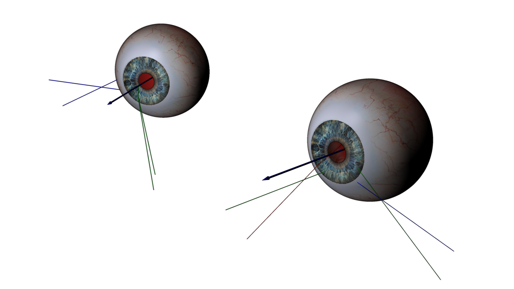
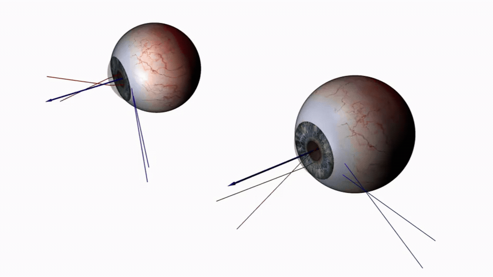

# VIVA_UPNA_Gaze_algorithm

This repository contains a Python-based gaze simulation and estimation toolkit.

  

    
    
<em>Simulated eyes</em>

  

  

    
    
<em>Gaze tracking demonstration</em>

  

## Architecture

The codebase is organized around three main components:

- **Simulator**: Simulates realistic eye motion scenarios and generates synthetic gaze measurements. Useful for testing, validation, and generating training data.
  
- **Demonstrator**: Handles user calibration and gaze estimation. Takes raw eye tracking data and produces gaze estimates through the calibrated model.

- **Umbrella Class**: A unified interface that seamlessly integrates the simulator and demonstrator, allowing them to communicate transparently and work together without exposing their individual complexities to the end user.

## Main library

The core implementation lives in `VIVA_UPNA_Sim_Dem.py`. It provides the simulator, demonstrator, and the helper routines used to model eye motion, generate measurements, and estimate gaze-related quantities.

## Examples and tutorial

At the moment, the main learning example is `tutorial/tutorial.ipynb`. It walks through the basic workflow for initializing the systems, loading configurations, and running several example analyses.

The repository is organized so that shared simulator assets live in `resources/`, while tutorial-specific configuration files are kept under `tutorial/additional_resources/`.

## Quick Start

1. Install the Python dependencies used by the simulator and the tutorial: `numpy`, `scipy`, `matplotlib`, `pyvista`, and `scikit-spatial`.
2. Open the project root in VS Code or your Python environment of choice.
3. Start from `tutorial/tutorial.ipynb` and run the first cell. It adds the project root to `sys.path`, imports `VIVA_UPNA_Sim_Dem.py`, and points the notebook to `tutorial/additional_resources/`.
4. Use `resources/` for the library assets that the simulator needs at runtime, and `tutorial/additional_resources/` for tutorial-only configuration files.

## Project layout

- `VIVA_UPNA_Sim_Dem.py`: main library module
- `resources/`: library resources used by the simulator
- `tutorial/tutorial.ipynb`: interactive tutorial and usage example
- `tutorial/additional_resources/`: tutorial-only configuration examples

## Acknowledgments

VIVA Project UE and by the Chips Joint Undertaking and its members (including top-up funding by Germany, Netherlands, Sweden and Denmark) Grant No. 101139942 
